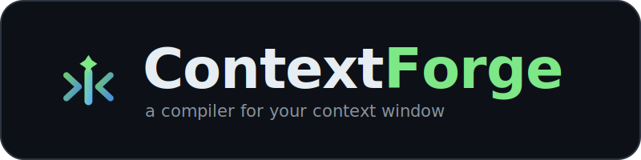

<p align="center">
  
</p>

<p align="center">
  <b>Stop context rot before it silently breaks your agents.</b><br>
  A context compiler for LLM agents — score · compress · reorder · budget.
</p>

<p align="center">
  <a href="#quickstart">Quickstart</a> ·
  <a href="#the-benchmark">Benchmark</a> ·
  <a href="#use-cases">Use cases</a> ·
  <a href="STRATEGY.md">Strategy</a> ·
  <a href="#license">License</a>
</p>

---

ContextForge is a *context compiler* that sits between your app and the model. It
**scores**, **compresses**, **reorders**, and **budgets** everything entering the
context window — so the model performs as if the input were short and clean.

Think *compiler + linter for context*, not another vector store.

---

## The problem: context rot

Every frontier model degrades as input grows — **not at the window limit, but well
before it.** Accuracy can fall 30–50% before the documented limit, with a sharp
knee well under the advertised "1M-token" ceiling. Counterintuitively, *coherent,
well-structured* input can degrade attention more than shuffled input, and the
failures show up in long, multi-tool agent sessions — exactly where standard
needle-in-a-haystack benchmarks miss them.

The result: a support agent that quietly starts giving wrong answers after a long
chat. Nobody touched the prompt. The context just rotted.

## What ContextForge does

```
   raw trace                         compiled context
 ┌───────────┐   ┌─────────────────────────────────┐   ┌───────────┐
 │ 280k tok  │   │ score → compress → reorder →     │   │  ~30k tok │
 │ tangled   │ ─▶│ budget   (auditable, lossless-ish)│ ─▶│ edge-     │
 │ history   │   │                                  │   │ anchored  │
 └───────────┘   └─────────────────────────────────┘   └───────────┘
       rot risk: 62/100 (high)            rot risk: 18/100 (low)
```

1. **Score** — a transparent 0–100 *rot risk* per call, broken into `load`,
   `redundancy`, `middle_burial`, and `fragmentation`. Put it in CI.
2. **Compress** — remove near-duplicates and trim provably stale, low-salience
   material. v0 is **extractive and auditable** — it never paraphrases away the
   one fact that mattered. (Abstractive LLM summarization is an opt-in upgrade.)
3. **Reorder** — fight "lost in the middle": lift load-bearing facts to a state
   header at the **front** and a recap at the **back**, where attention is
   strongest. Dialogue order is preserved; free-floating docs get arranged
   edges-in.
4. **Budget** — enforce a hard token ceiling, dropping the least-salient,
   non-pinned items first. Every drop is logged.

Everything is recorded in an **action log** — the "what the model actually saw"
audit trail.

## Quickstart

```bash
pip install -e .            # core has zero dependencies
# optional: exact token counts + real-model benchmarking
pip install -e ".[all]"

# 1. Score a trace's rot risk
contextforge score examples/sample_trace.json

# 2. Compile it down to a 30k-token budget and see the deltas
contextforge compile examples/sample_trace.json --budget 30000 --out compiled.json

# 3. See it on the bundled sample in one command
contextforge demo
```

### Library

```python
from contextforge import ContextCompiler, Trace

trace  = Trace.load("examples/sample_trace.json")
result = ContextCompiler(target_tokens=30_000).compile(trace)

print(result.summary())
messages = result.to_messages()      # hand straight to your model SDK
print(result.rot_before.total, "→", result.rot_after.total)
```

A `Trace` is just an ordered list of items (chat turns, tool results, retrieved
docs, memories). Mark anything you must never lose with `pinned: True`.

## The benchmark

The proof is a **measured accuracy + token delta on real traces**. The harness
runs your model on the raw vs. compiled context and reports both:

```bash
# zero-setup proxy model (deterministic, runs in CI)
python -m bench.benchmark bench/datasets/sample_suite.json --model stub

# real frontier model
export ANTHROPIC_API_KEY=...
contextforge bench bench/datasets/sample_suite.json --model claude-opus-4-8
```

On the bundled buried-fact suite, the modeled agent **misses** the load-bearing
fact in the raw 250k-token trace and **recovers** it after compilation — at a
fraction of the tokens. Point it at *your* traces and find out what you'd win.

> The bundled sample is filler-heavy by design to make rot legible; real traces
> vary. The number that matters is the one you measure on your own data.

## Drop-in proxy (zero-code adoption)

Don't want to touch your code? Point your SDK's `base_url` at ContextForge. It
parses each request, compiles the context, forwards the smaller request upstream,
and returns the response unchanged — with the deltas in `x-contextforge-*` headers.

```bash
# Anthropic-compatible, compiling everything to a 30k budget
contextforge proxy --api anthropic --port 8788 --budget 30000

# Inspect what it *would* send, with no API key and no upstream call:
contextforge proxy --api anthropic --budget 30000 --dry-run
```

```python
from anthropic import Anthropic
client = Anthropic(base_url="http://localhost:8788")   # that's the whole change
```

Works for `--api openai` too. Response headers report
`x-contextforge-rot-before/after` and `x-contextforge-tokens-before/after/saved`.

> v0 proxy is non-streaming and flattens content blocks to text. Anchoring is
> best-effort from raw messages (no `pinned`/`kind` metadata); for maximum
> control, use the SDK with a curated `Trace`.

## Per-model rot calibration

The degradation knee is a property of the *model*, not a constant. Measure it,
then the rot score reflects how *your* model actually degrades.

```bash
# 1. Sweep accuracy vs. context size to get a degradation curve
python -m bench.sweep --model claude-opus-4-8 --out profiles/opus.json

# 2. Fit a knee and save it to the profile registry
contextforge calibrate profiles/opus.json --model claude-opus-4-8 --save

# 3. score/compile now auto-load the profile for that model
contextforge score examples/sample_trace.json --model claude-opus-4-8
```

Profiles live in `profiles/profiles.json` (override with `$CONTEXTFORGE_PROFILES`).
This is the start of the real moat: a corpus of per-model knees fitted from evals.

## Use cases

- **[OpenClaw](docs/use-cases/openclaw.md)** — a 24/7 personal agent whose context
  balloons across endless tool calls. Drop the proxy in front of it: on a synthetic
  long session, **228k → 20k tokens (~91% smaller)**, rot **moderate → low**, and a
  buried standing rule the agent had forgotten is lifted back to the window edge.
  Runnable: [`examples/openclaw_proxy.py`](examples/openclaw_proxy.py).

## Why this is defensible

The moat isn't any single model call — it's **the eval data and the policies**: a
growing corpus of context-rot evals across models and tasks, learned
compression/ordering tuning per model, and the switching cost once a team trusts
your *rot score* in CI. Own the benchmark and the fix together.

## Status

`v0.1` — the 30-day smallest test, made real: an open context-rot benchmark and a
CLI that, given a long-context trace, returns a compressed/re-ordered context with
a measured accuracy + token delta. See [STRATEGY.md](STRATEGY.md) for the
wedge→platform plan and [bench/README.md](bench/README.md) for the benchmark
methodology.

## Layout

```
contextforge/        the compiler (score · compress · reorder · budget)
  tokens.py          token counting (tiktoken or heuristic)
  salience.py        per-item importance scoring
  rot.py             context-rot risk score
  compress.py        normalize · dedup · truncate
  reorder.py         edge-anchoring + free-item reorder
  budget.py          hard token-ceiling enforcement
  compiler.py        the pipeline orchestrator
  adapters.py        Anthropic/OpenAI request <-> Trace conversion
  proxy.py           drop-in compiling proxy server
  profiles.py        per-model rot-profile registry
  calibrate.py       fit a degradation knee from measurements
  cli.py             `contextforge` command
bench/               the reproducible benchmark harness
  benchmark.py       accuracy + token delta on a suite
  sweep.py           accuracy-vs-size sweep for calibration
profiles/            fitted per-model rot profiles
docs/use-cases/      integration use cases (e.g. OpenClaw)
assets/              logo, app icons, favicon, social card
examples/            sample trace + openclaw_proxy.py
tests/               pytest suite
```

## License

Apache-2.0 (open-source core).
